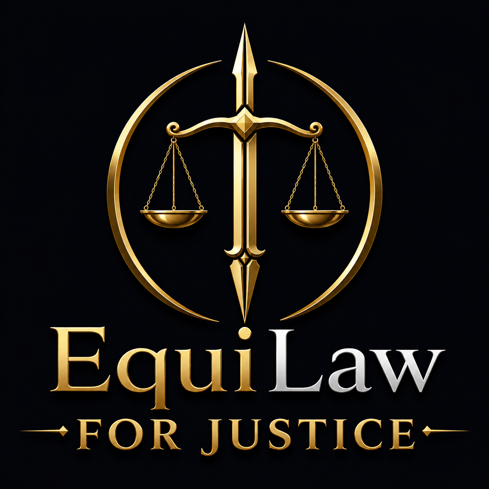
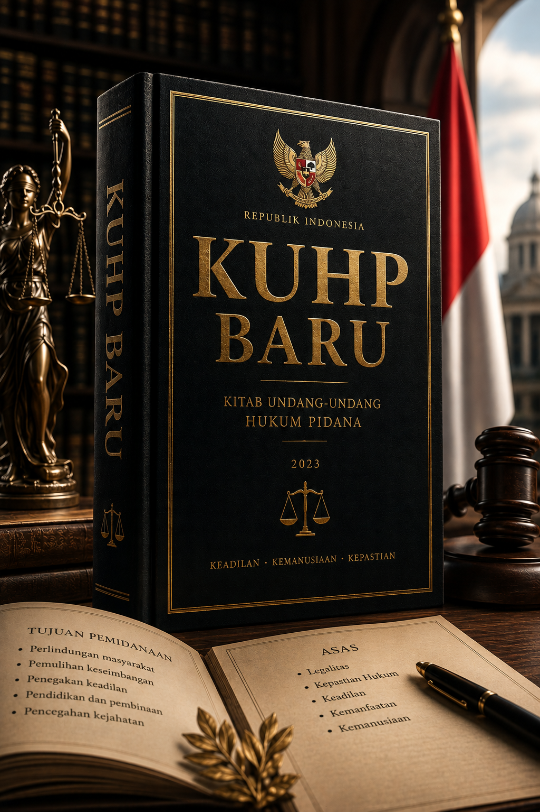
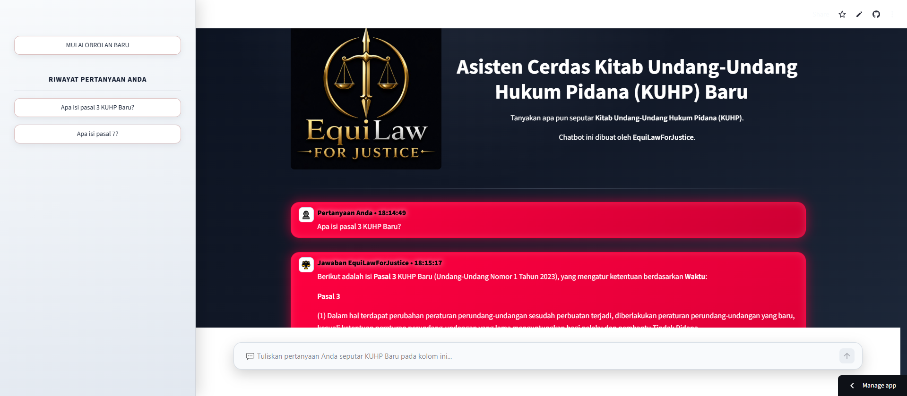
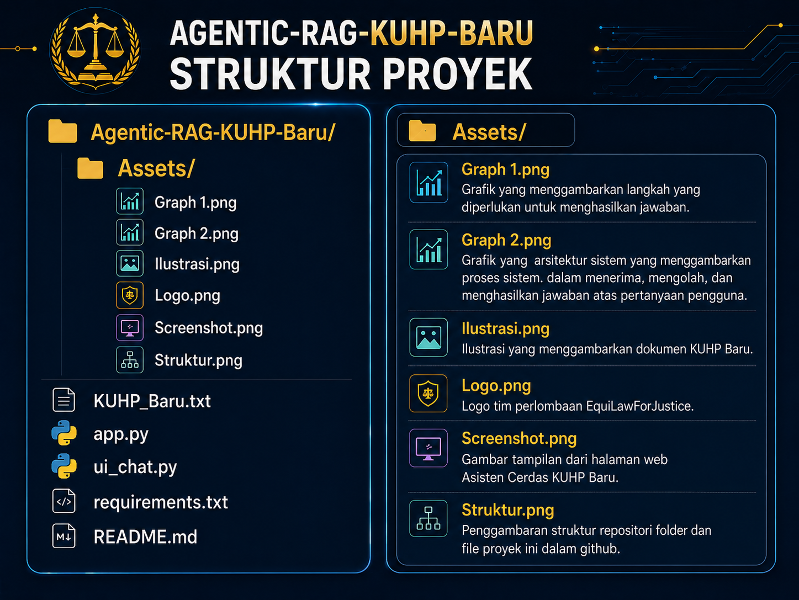

# ⚖️ Agentic RAG KUHP Baru

### AI-Powered Legal Assistant untuk Undang-Undang Nomor 1 Tahun 2023 tentang Kitab Undang-Undang Hukum Pidana

<p align="center">
  
</p>

<p align="center">
  <strong>AI for Equal Justice</strong><br>
  Asisten hukum berbasis Agentic Retrieval-Augmented Generation (Agentic RAG)
  untuk membantu memahami KUHP Baru secara lebih mudah, kontekstual, dan berbasis sumber.
</p>

<p align="center">


</p>

---

## 📌 Tentang Proyek

**Agentic RAG KUHP Baru** merupakan aplikasi asisten hukum berbasis **Artificial Intelligence (AI)** yang dirancang untuk membantu masyarakat memperoleh informasi dan memahami ketentuan dalam **Undang-Undang Nomor 1 Tahun 2023 tentang Kitab Undang-Undang Hukum Pidana (KUHP Baru)**.

Proyek ini mengimplementasikan pendekatan **Agentic Retrieval-Augmented Generation (Agentic RAG)** yang mengombinasikan kemampuan **Large Language Model (LLM)**, retrieval dokumen hukum, workflow agen berbasis **LangGraph**, serta berbagai sumber informasi pendukung. Berbeda dari sistem pencarian berbasis kata kunci sederhana, agen dirancang untuk memahami konteks pertanyaan, menentukan informasi yang dibutuhkan, melakukan retrieval terhadap sumber yang relevan, melakukan pencarian sumber yang dibutuhkan di internet (sumber eksternal), mengevaluasi kecukupan informasi, dan menghasilkan jawaban berdasarkan konteks yang diperoleh. Selain itu, sistem ini juga bisa menolak pertanyaan yang tidak berhubungan dengan KUHP Baru waluapun mengandung kata kunci yang menyerupai pertanyaan tentang KUHP Baru. Sistem juga dilengkapi dengan **conversation memory**, sehingga konteks pertanyaan sebelumnya dapat dipertahankan selama sesi percakapan. Hal tersebut memungkinkan pengguna mengajukan pertanyaan lanjutan tanpa harus mengulangi seluruh konteks pembicaraan.

> **AI for Equal Justice** — teknologi AI dimanfaatkan sebagai sarana pendukung untuk memperluas akses terhadap informasi seputar KUHP Baru yang akurat, transparan, dan mudah dipahami.

---

## 🎯 Latar Belakang

Perkembangan kecerdasan buatan telah membuka peluang baru dalam penyediaan layanan informasi di berbagai bidang, termasuk bidang hukum. Di Indonesia, kebutuhan terhadap akses informasi hukum semakin relevan setelah diberlakukannya **Undang-Undang Nomor 1 Tahun 2023 tentang Kitab Undang-Undang Hukum Pidana (KUHP Baru)**. KUHP Baru memiliki struktur dan substansi yang kompleks serta memuat **624 pasal**. Bagi masyarakat yang tidak memiliki latar belakang hukum, memahami keseluruhan ketentuan tersebut dapat menjadi tantangan. Permasalahan semakin kompleks ketika pencarian informasi hukum dilakukan menggunakan sistem berbasis keyword search. Pencarian berbasis kata kunci dapat menemukan dokumen yang mengandung istilah tertentu, tetapi belum tentu memahami:
* konteks pertanyaan;
* maksud pengguna;
* hubungan antarketentuan;
* konsep hukum yang sedang ditanyakan;
* informasi apa yang sebenarnya dibutuhkan;
* serta bagaimana menjelaskan ketentuan hukum dalam bahasa yang mudah dipahami.

Di sisi lain, penggunaan LLM tanpa sumber eksternal atau mekanisme retrieval memiliki risiko **hallucination**, yaitu menghasilkan informasi yang terdengar meyakinkan tetapi tidak memiliki dasar yang benar. Oleh karena itu, proyek ini mengadopsi pendekatan **Agentic RAG** untuk menggabungkan kemampuan reasoning LLM dengan retrieval terhadap sumber hukum.

---

# ❗ Problem Statement

### Permasalahan Utama

Terdapat beberapa permasalahan yang ingin diselesaikan melalui proyek ini:

1. **Kompleksitas KUHP Baru**
   <br>KUHP Baru terdiri dari 624 pasal sehingga membutuhkan waktu dan ketelitian untuk dipelajari secara menyeluruh.
3. **Kesulitan masyarakat memahami bahasa hukum**
   <br>Istilah dan struktur bahasa hukum sering kali sulit dipahami oleh masyarakat yang tidak memiliki latar belakang hukum.
4. **Keterbatasan keyword search**
   <br>Sistem pencarian konvensional cenderung berorientasi pada kecocokan kata, bukan pemahaman terhadap konteks pertanyaan.
5. **Keterbatasan LLM tanpa retrieval**
   <br>LLM dapat menghasilkan jawaban yang tidak memiliki dasar hukum yang memadai apabila tidak diberikan sumber informasi yang relevan.
6. **Kebutuhan terhadap informasi hukum yang dapat ditelusuri**
   <br>Jawaban hukum idealnya dapat dikaitkan kembali dengan sumber hukum yang menjadi dasar informasi tersebut.

### Solusi yang Ditawarkan

Proyek ini menggunakan pendekatan **Agentic Retrieval-Augmented Generation** sehingga sistem dapat:

<p align="left">
  
</p>

Dengan demikian, sistem tidak hanya berfungsi sebagai chatbot, tetapi sebagai **agen yang dapat menentukan langkah yang diperlukan untuk menghasilkan jawaban**.

---

# 👥 Target Pengguna
Aplikasi dirancang untuk berbagai kelompok pengguna setidak-tidaknya dapat digunakan oleh pihak-pihak di bawah ini.

1. **Masyarakat Umum**
<br>Membantu memperoleh pemahaman awal mengenai ketentuan KUHP Baru tanpa harus memahami terminologi hukum secara mendalam.
2. **Mahasiswa dan Pelajar**
<br>Dapat digunakan sebagai media pembelajaran interaktif untuk mengeksplorasi konsep, pasal, serta hubungan antarketentuan dalam KUHP Baru.
3. **Akademisi dan Peneliti**
<br>Mendukung proses eksplorasi dan penelusuran informasi hukum dalam kegiatan akademik dan penelitian.
4. **Praktisi Hukum**
<br>Dapat digunakan sebagai alat bantu pencarian awal terhadap referensi hukum.
5. **Instansi Pemerintah dan Pelayanan Publik**
<br>Berpotensi digunakan sebagai pendukung penyediaan informasi hukum kepada masyarakat.

---

# ✨ Fitur Utama

1. **Agentic RAG**
<br>Menggunakan workflow agen untuk menentukan langkah retrieval dan reasoning secara adaptif.
2. **KUHP Baru sebagai Knowledge Base Utama**
<br>Dokumen **Kitab Undang-Undang Hukum Pidana (KUHP) Baru** digunakan sebagai sumber pengetahuan utama sistem.
3. **LLM Reasoning**
<br>LLM digunakan untuk memahami pertanyaan, mengintegrasikan informasi, serta menyusun jawaban berdasarkan konteks.
4. **Multi-Source Retrieval**
<br>Sistem dapat memanfaatkan sumber informasi internal maupun eksternal sesuai kebutuhan.
5. **Conversation Memory**
<br>Konteks percakapan dipertahankan selama sesi sehingga pengguna dapat mengajukan pertanyaan lanjutan secara natural.
6. **Iterative Retrieval**
<br>Apabila informasi yang diperoleh belum memadai, workflow dapat kembali melakukan retrieval untuk memperoleh informasi tambahan.
7. **Source-Grounded Answer**
<br>Jawaban diarahkan agar tetap berlandaskan sumber informasi yang digunakan dalam proses retrieval.
8. **Observability**
<br>Proses workflow agen dapat dipantau selama pengembangan dan evaluasi menggunakan LangSmith.

---

# 🏗️ Arsitektur Sistem

Secara konseptual, arsitektur sistem terdiri atas beberapa lapisan sebagai berikut ini.

<p align="left">
  
</p>

Arsitektur tersebut menggambarkan proses sistem dalam menerima, mengolah, dan menghasilkan jawaban atas pertanyaan pengguna. Secara ringkas penjelasan alur di atas adalah sebagai berikut ini:
1. Proses dimulai ketika pengguna berinteraksi melalui Antarmuka Streamlit sebagai media untuk memasukkan pertanyaan.
2. Selanjutnya, sistem melakukan analisis pertanyaan guna memahami maksud dan kebutuhan informasi.
3. Setelah itu, sistem menentukan apakah pertanyaan tersebut relevan. Jika tidak relevan, proses dihentikan dan sistem memberikan keterangan bahwa pertanyaan tidak berkaitan dengan KUHP Baru sehingga sistem tidak dapat memberikan jawaban lebih lanjut.
4. Jika relevan, proses dilanjutkan ke tahap Pemilihan Sumber untuk menentukan sumber informasi yang sesuai.
5. Kemudian, sistem melakukan Pengambilan Multi-sumber dengan mengumpulkan informasi dari berbagai sumber yang tersedia.
6. Informasi tersebut selanjutnya dievaluasi untuk menilai tingkat kecukupannya, baik cukup, sebagian, maupun belum cukup.
7. Berdasarkan hasil evaluasi, sistem menyusun jawaban akhir yang paling sesuai dengan pertanyaan dan informasi yang diperoleh.
8. Tahap terakhir adalah pemberian respons kepada pengguna.

Dengan demikian, alur ini menunjukkan proses yang sistematis, mulai dari pemahaman pertanyaan, validasi relevansi, pencarian informasi, evaluasi sumber, hingga penyusunan jawaban akhir yang diharapkan akurat dan relevan. Pendekatan ini membantu sistem menjaga ketepatan informasi, mengurangi kesalahan, dan memastikan respons akhir tetap relevan dengan kebutuhan pengguna secara lebih konsisten.

---

# 📚 Pengetahuan Dasar

Sumber pengetahuan utama aplikasi adalah:

<p align="left">
  
</p>

Dokumen tersebut berisi teks **Undang-Undang Nomor 1 Tahun 2023 tentang Kitab Undang-Undang Hukum Pidana** yang digunakan sebagai basis informasi utama dalam proses retrieval. Prioritas terhadap dokumen hukum utama dimaksudkan agar jawaban yang berkaitan langsung dengan substansi KUHP tetap memiliki landasan hukum yang jelas. Sumber eksternal hanya digunakan sebagai informasi pendukung ketika dibutuhkan, bukan sebagai pengganti sumber hukum utama.

---

# 🔎 Retrieval & External Tools

Sistem dapat menggunakan beberapa sumber informasi pendukung.

1. **KUHP Baru**
<br>Merupakan **knowledge source intenal utama** untuk pertanyaan yang berkaitan dengan substansi KUHP Baru.
2. **Wikipedia**
<br>Digunakan untuk membantu memperoleh informasi konseptual mengenai istilah atau konsep tertentu.
3. **ArXiv**
<br>Digunakan untuk memperoleh referensi akademik yang relevan.
4. **Tavily Search**
<br>Digunakan untuk memperoleh informasi eksternal dan informasi terbaru yang membutuhkan pencarian web.

---

# 💬 Memori Percakapan

Aplikasi mendukung percakapan multi-turn, yakni bentuk dialog yang terdiri dari dua atau lebih pertukaran pesan beruntun di mana arti dan respons yang tepat bergantung pada apa yang dikatakan pada tahap sebelumnya.

Contohnya:

```text
User:
Apa bunyi pasal 3 KUHP Baru?

Agent:
[Jawaban mengenai pasal 3 yang terdiri dari 7 ayat.]

User:
Jelaskan ayat 7 di atas?

Agent:
[Jawaban menggunakan konteks percakapan sebelumnya. Agen mengetahui bahwa yang dimaksud ayat 7 di pasal 3 bukan pasal lain.]

User:
Jelaskan ayat sebelumnya?

Agent:
[Jawaban menggunakan konteks percakapan sebelumnya. Agen mengetahui bahwa yang dimaksud ayat sebelumnya adalah ayat 6 pasal 3 karena konteks percakapan sebelumnya pasal 3 ayat 7.]
```

Dengan mekanisme tersebut, pengguna tidak selalu perlu mengulang konteks pada setiap pertanyaan. Conversation memory sangat berguna ketika pengguna melakukan eksplorasi hukum secara bertahap.

Selain itu, sistem ini juga dirancang untuk mengelola riwayat percakapan pengguna secara terstruktur agar setiap sesi obrolan memiliki konteks yang jelas dan tidak saling bercampur. Ketika pengguna sedang melakukan percakapan kemudian menekan tombol **MULAI OBROLAN BARU**, sistem akan membuat sesi percakapan baru dan menyimpan percakapan sebelumnya pada bagian sisi kiri halaman dengan label **RIWAYAT PERCAKAPAN**. Dengan mekanisme tersebut, percakapan yang baru dimulai tidak akan membawa atau mencampurkan konteks dari percakapan sebelumnya, sehingga pengguna dapat memulai pembahasan dengan topik, tujuan, atau kebutuhan yang berbeda secara lebih terarah.

Setiap percakapan yang telah ditinggalkan karena pengguna memilih **MULAI OBROLAN BARU** akan ditampilkan sebagai bagian tersendiri dalam **RIWAYAT PERCAKAPAN**. Pengguna dapat mengenali dan memilih percakapan terdahulu yang ingin dilanjutkan. Apabila pengguna mengeklik salah satu riwayat percakapan tersebut, sistem akan membuka kembali sesi percakapan yang dipilih sehingga pengguna dapat melanjutkan pembahasan sesuai dengan konteks yang terdapat dalam percakapan tersebut. Dengan demikian, pengguna tidak perlu mengulang informasi, pertanyaan, atau penjelasan yang sebelumnya telah disampaikan selama konteks percakapan masih tersedia.

Mekanisme ini bertujuan memberikan pengalaman interaksi yang lebih rapi, terorganisasi, dan mudah digunakan, khususnya ketika pengguna menangani beberapa topik dalam satu halaman. Pemisahan sesi juga membantu mengurangi risiko informasi dari percakapan lama terbawa ke percakapan baru dan memengaruhi respons sistem.

Namun, penyimpanan riwayat percakapan dalam mekanisme ini memiliki keterbatasan. Riwayat hanya dipertahankan selama pengguna masih berada pada halaman tersebut dan sesi halaman belum terputus. Apabila pengguna melakukan penyegaran atau *refresh* halaman, riwayat percakapan yang tersimpan pada sesi tersebut tidak dijamin tetap tersedia. Demikian pula, apabila koneksi internet terputus, kesinambungan sesi dan ketersediaan riwayat dapat terganggu. **Oleh karena itu, mekanisme ini pada dasarnya merupakan penyimpanan riwayat berbasis sesi aktif, bukan penyimpanan permanen. Pengguna sebaiknya menyelesaikan atau mencatat percakapan penting sebelum melakukan penyegaran halaman atau meninggalkan sesi.**

---

# 📚 Kemampuan Utama

Beberapa kemampuan utama yang dimiliki oleh Asisten cerdas KUHP Baru ini di antaranya adalah sebagai berikut ini.

1. **Menampilkan bunyi atau isi buku, bab, paragraf, pasal, dan ayat dalam KUHP Baru.**
<br>Sistem dapat menampilkan ketentuan KUHP Baru berdasarkan bagian yang dipilih, mulai dari buku bab, paragraf, pasal, hingga ayat. Pengguna dapat mengakses isi ketentuan secara lebih cepat dan terstruktur.

2. **Memberikan penjelasan ringkas buku, bab, paragraf, pasal, dan ayat dalam KUHP Baru.**
<br>Sistem memberikan penjelasan sederhana mengenai substansi ketentuan yang dipilih agar lebih mudah dipahami. Penjelasan disesuaikan dengan konteks dan tingkat ketentuan yang sedang dibaca.

3. **Deskripsi mengenai KUHP Baru.**
<br>Sistem menyediakan informasi dan gambaran umum mengenai KUHP Baru, termasuk struktur, ruang lingkup, karakteristik pengaturannya, jumlah pasal, dan lain-lain. Hal ini membantu pengguna memperoleh pemahaman awal sebelum mendalami ketentuan tertentu.

4. **Membuat artikel dan makalah seputar KUHP Baru.**
<br>Sistem dapat membantu menyusun artikel, makalah, maupun tulisan akademik yang membahas berbagai isu terkait KUHP Baru. Pengguna dapat mengembangkan topik berdasarkan kebutuhan dan tujuan penulisannya.

5. **Menampilkan suatu berita, karya ilmiah, dan yurisprudensi KUHP Baru dari sumber-sumber eksternal di internet.**
<br>Sistem dapat membantu menemukan dan menampilkan informasi dari sumber eksternal di internet yang relevan dengan KUHP Baru. Sumber tersebut dapat berupa berita, karya ilmiah, putusan atau yurisprudensi, serta referensi lainnya.

6. **Membantu eksplorasi mengenai tindakan pidana, pasal dan ayat yang mengatur, unsur-unsur pidana, sanksi/hukuman pidana, dan hal-hal yang berkaitan dengan hal tersebut.**
<br>Sistem membantu pengguna menelusuri hubungan antara suatu tindakan pidana dengan ketentuan yang mengaturnya, termasuk unsur tindak pidana dan sanksinya. Dengan demikian, pengguna dapat mengeksplorasi suatu persoalan hukum secara lebih sistematis dan komprehensif.

7. **Kemampuan lainnya yang berkaitan dengan KUHP Baru.**


---
# 🖥️ Tampilan dan Cara Penggunaan

Tampilan dari halaman web Asisten Cerdas KUHP Baru seperti yang terlihat pada gambar berikut ini.



Antarmuka aplikasi dirancang agar pengguna dapat melakukan interaksi dengan agen melalui percakapan secara langsung.

Adapun langkah-langkah penggunaan dari asisten cerdas ini adalah sebagai berikut ini:

1. Kunjungi situs web di bawah ini melalui peramban Anda.
<br>Tautan menuju halaman web: https://bit.ly/AsistenCerdasKUHPBaru
2. Tanpa perlu membuat akun dan masuk sebagai pengguna, Anda dapat langsung menggunakan asisten ini. Tuliskan pertanyaan Anda seputar KUHP Baru yang masih dalam ruang lingkup kemampuan sistem ini (Lihat bagian: Kemampuan Utama) sesuai dengan kebutuhan Anda.
3. Apabila Anda bertanya sesuatu hal yang tidak relevan dengan KUHP baru, maka asisten akan menolak untuk menjawab pertanyaan Anda.
4. Setelah selesai menuliskan pertanyaan tekan tombol anak panah ke atas atau enter. Tunggu sistem memproses, menganalisis, dan memberikan jawaban atas pertanyaan Anda.
5. Jika proses generasi jawaban sudah selesai maka akan muncul jawaban di bawah prtanyaan Anda disertai kolom "Analisis" yang membantu pengguna untuk mengetahui bagaimana sistem memproses dan menjawab pertanyaan pengguna.
6. Lanjutkan percakapan tanpa khawatir kehilangan konteks pertanyaan selama masih dalam batas context window sistem ini. Apabila jumlah percakapan sudah terlalu banyak mungkin saja sistem mengalami kehilangan konteks sehingga secara berkala berikan konteks tambahan agar sistem mampu menjawab sesuai dengan konteks dan keinginan pengguna.
7. Apabila Anda ingin memulai percakapan dengan topik atau pembahasan yang berbeda, tekan tombol "MULAI OBROLAN BARU". Sistem akan membuat sesi percakapan baru sehingga konteks dari percakapan sebelumnya tidak tercampur dengan percakapan yang baru dimulai.
8. Ketika tombol "MULAI OBROLAN BARU" ditekan, percakapan sebelumnya akan tersimpan pada bagian sisi kiri halaman dalam kolom "RIWAYAT PERCAKAPAN". Setiap percakapan yang tersimpan akan menjadi riwayat tersendiri sehingga dapat dibedakan dari percakapan yang sedang berlangsung.
9. Untuk melanjutkan percakapan sebelumnya, pilih atau klik percakapan terdahulu yang terdapat pada kolom "RIWAYAT PERCAKAPAN". Sistem akan membuka kembali percakapan tersebut sehingga Anda dapat melanjutkan pertanyaan atau pembahasan sesuai dengan konteks percakapan sebelumnya.
10. Riwayat percakapan pada kolom "RIWAYAT PERCAKAPAN" hanya tersimpan selama Anda masih berada pada halaman aplikasi, tidak melakukan penyegaran atau "refresh" halaman, dan koneksi internet tetap terhubung. Apabila halaman disegarkan, ditutup, atau koneksi internet terputus, riwayat percakapan yang tersimpan pada sesi tersebut tidak dijamin tetap tersedia.
11. Oleh karena itu, untuk percakapan yang penting atau memiliki konteks pembahasan yang panjang, disarankan untuk tidak melakukan "refresh" halaman dan memastikan koneksi internet tetap stabil selama menggunakan aplikasi. Mekanisme "RIWAYAT PERCAKAPAN" pada aplikasi ini bersifat sementara selama sesi aktif dan bukan merupakan penyimpanan riwayat secara permanen.

Selain itu, cara penggunaannya juga dapat disaksikan dalam video demo berikut ini:
[](https://drive.google.com/file/d/1UUHk0pTFcmqP7q6kDZb23kqjlNeO9bzQ/view?usp=sharing)

---

# 📂 Struktur Repositori

<p align="left">
  
</p>

### Penjelasan

Struktur proyek terdiri dari kode aplikasi, sumber data KUHP Baru, serta aset pendukung untuk sistem Agentic-RAG.
1. **Assets/**
<br>Berisi seluruh aset visual yang digunakan untuk dokumentasi dan tampilan proyek, seperti diagram alur, ilustrasi, logo, screenshot antarmuka, dan gambar struktur repositori.
2. **KUHP_Baru.txt**
<br>Merupakan basis pengetahuan utama yang berisi teks atau materi KUHP Baru yang digunakan sebagai sumber informasi dalam proses Retrieval-Augmented Generation (RAG).
3. **app.py**
<br>Berfungsi sebagai aplikasi utama/backend yang mengatur logika Agentic-RAG, termasuk pemrosesan pertanyaan, penggunaan tools/agent, retrieval, dan pembentukan jawaban.
4. **ui_chat.py**
<br>Mengatur antarmuka percakapan (chat UI) sehingga pengguna dapat berinteraksi dengan sistem melalui halaman web.
5. **requirements.txt**
<br>Berisi daftar library Python dan dependensi yang diperlukan untuk menjalankan proyek.
6. **README.md**
<br>Berisi dokumentasi proyek, seperti deskripsi sistem, cara instalasi, konfigurasi, struktur proyek, dan cara menjalankan aplikasi.

---

# ⚠️ Limitasi

Proyek ini memiliki beberapa keterbatasan.
1. **Potensi Halusinasi**
<br>Meskipun Agentic RAG dirancang untuk mengurangi halusinasi melalui retrieval dan evaluasi, sistem berbasis LLM tetap memiliki kemungkinan menghasilkan informasi yang tidak sempurna, walaupun kemungkinan itu sangat kecil.
2. **Ketergantungan terhadap Sumber**
<br>Kualitas jawaban sangat dipengaruhi oleh kualitas dan kelengkapan sumber yang tersedia. Apabila ada perubahan-perubahan pasal dalam KUHP Baru maka sistem tidak serta merta akan mengikuti perubahan terbaru tersebut, melainkan harus dilakukan penyesuaian terhadap sumber dokumen utama.
3. **Keterbatasan Model**
<br>Sistem ini masih menggunakan model gratis dengan kapasitas tertentu dapat memiliki keterbatasan context window, rate limit, reasoning capability, jumlah pemanggilan tools, dan jumlah pencarian sumber-sumber eksternal.
4. **Belum terdapat halaman pembuatan akun pengguna**
<br>Walaupun di sisi lain memudahkan pengguna saat menggunakan sistem ini karena tidak perlu membuat dan masuk ke akun, ketiadaan halaman akun pengguna menyebabkan riwayat pesan hanya bertahan dalam satu sesi percakapan. Artinya, jika pengguna meninggalkan halaman ini atau koneksi internet terputus maka seluruh riwayat percakapan akan hilang.

---

# 🔒 Responsible AI

Karena aplikasi berada dalam domain hukum, penggunaan AI perlu dilakukan secara bertanggung jawab. Prinsip yang digunakan dalam proyek ini meliputi:
* mengutamakan sumber hukum sebagai landasan;
* membedakan informasi hukum dari interpretasi AI;
* tidak memosisikan AI sebagai pengganti profesional hukum;
* mendorong verifikasi terhadap sumber resmi;
* menjaga kerahasiaan API credentials;
* serta menyadari keterbatasan model generatif.
Tujuan utama sistem adalah **mempermudah akses terhadap informasi hukum**, bukan memberikan keputusan hukum yang mengikat.

---

# 🌱 Dampak

Teknologi AI memiliki potensi untuk membantu mengurangi hambatan akses terhadap informasi hukum. Melalui aplikasi ini, pengguna dapat memperoleh sarana untuk:
* memahami konsep hukum;
* mencari ketentuan dalam KUHP Baru;
* mengeksplorasi pertanyaan hukum layaknya sedang bercakap-cakap dengan rekannya;
* menemukan informasi yang relevan dengan lebih cepat;
* serta memahami informasi hukum dengan bahasa yang lebih mudah dicerna.
Dampak yang diharapkan tidak hanya bersifat teknis, tetapi juga sosial melalui peningkatan **literasi hukum** dan akses terhadap informasi.

---

# 🔮 Pengembangan Berikutnya

Pengembangan selanjutnya dapat diarahkan pada beberapa aspek.
1. **Vector Database**
<br>Mengintegrasikan vector database untuk memungkinkan semantic retrieval yang lebih efisien ketika jumlah dokumen semakin besar.
2. **Model yang Lebih Cerdas**
<br>Mengganti model gratis yang memiliki beberapa keterbatasan dengan model berbayar yang lebih cerdas dan memiliki keterbatasan yang relatif lebih sedikit untuk meningkatkan kemampuan reasoning, terutama untuk pertanyaan hukum yang membutuhkan analisis multi-langkah, dan memperbanyak jumlah pencarian sumber eksternal.
3. **Halaman Pengguna**
<br>Menambahkan halaman pembuatan akun pengguna agar tiap pengguna yang menggunakan sistem ini memiliki halaman pribadi yang dapat menyimpan seluruh riwayat percakapan sebelumnya agar dapat membaca atau meneruskan percakapan kapan pun pengguna menginginkannya. 
4. **Multi-Regulation Knowledge Base**
<br>Memperluas knowledge base dari KUHP menjadi berbagai regulasi lain, seperti KUHAP, KUHPerdata, peraturan pemerintah, peraturan sektoral, serta regulasi nasional lainnya.
5. **Hasil yang Lebih Terstruktur**
<br>Mengembangkan mekanisme sitasi pasal secara lebih terstruktur sehingga pengguna dapat mengetahui dasar hukum dari setiap bagian jawaban. Selain itu, juga perlu membangun representasi hubungan dalam bentuk visual/grafik menggenai unsur tindak pidana, sanksi, pengecualian, dan pasal terkait sehingga hubungan antar ketentuan dapat dieksplorasi secara visual.

---

# 📚 Referensi

1. Undang-Undang Republik Indonesia Nomor 1 Tahun 2023 tentang Kitab Undang-Undang Hukum Pidana.
2. Dokumentasi LangChain, LangGraph, Streamlit, OpenRouter, Tavily, dan LangSmith.
3. https://www.unigoro.ac.id/tahun-2026-menyongsong-kehadiran-kuhp-baru/ diakses pada Kamis, 30 Juli 2026 pukul 10:13 WIB.
4. https://www.hukumonline.com/berita/a/ini-12-ketentuan-kuhp-baru-yang-potensial-timbulkan-masalah-It6967ccec2b9d2/ diakses pada Kamis, 30 Juli 2026 pukul 10:32 WIB.

---

## ⚖️ Penafian

**Agentic RAG KUHP Baru merupakan sistem berbasis kecerdasan buatan untuk membantu akses dan pemahaman awal terhadap informasi hukum. Sistem ini bukan merupakan pengganti konsultasi hukum profesional dan tidak memberikan nasihat hukum yang mengikat.** Pengguna disarankan untuk melakukan verifikasi terhadap **sumber hukum resmi** dan berkonsultasi dengan profesional hukum apabila membutuhkan analisis atau tindakan hukum yang spesifik.

---

<p align="center">

### ⚖️ EquiLawForJustice: AI for Equal Justice

**Mendorong akses informasi hukum yang lebih mudah, transparan, dan inklusif melalui Artificial Intelligence.**

</p>
